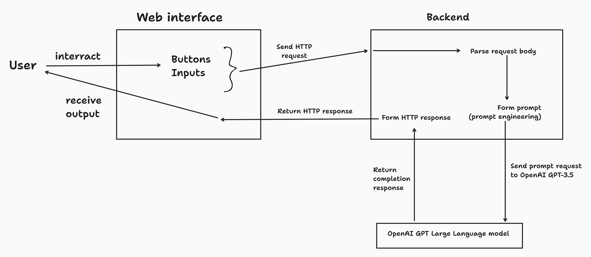
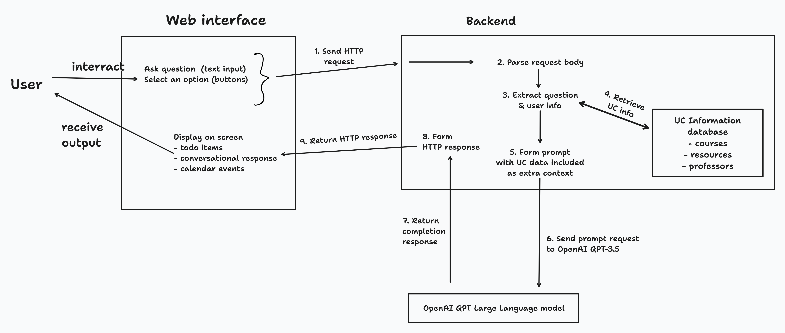
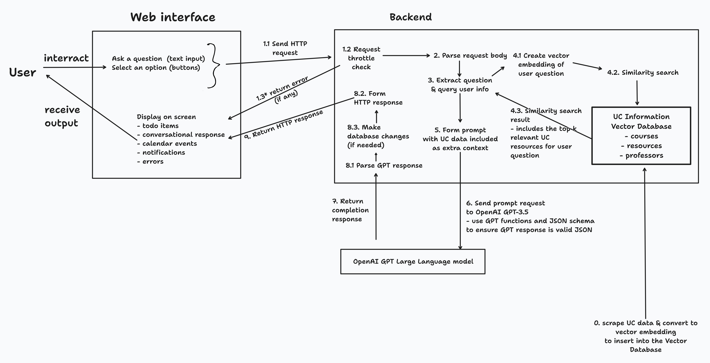

# Design diagrams

The Design Diagrams are graphical depictions of what our project will do, including the steps the entire system will perform within a typical request-response cycle.

Credit: The design are drawn using the online tool [tldraw](https://tldraw.com)

## D0 diagram

## D1 diagram

## D2 diagram

